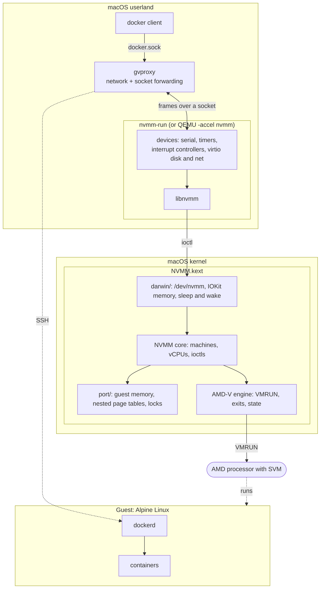
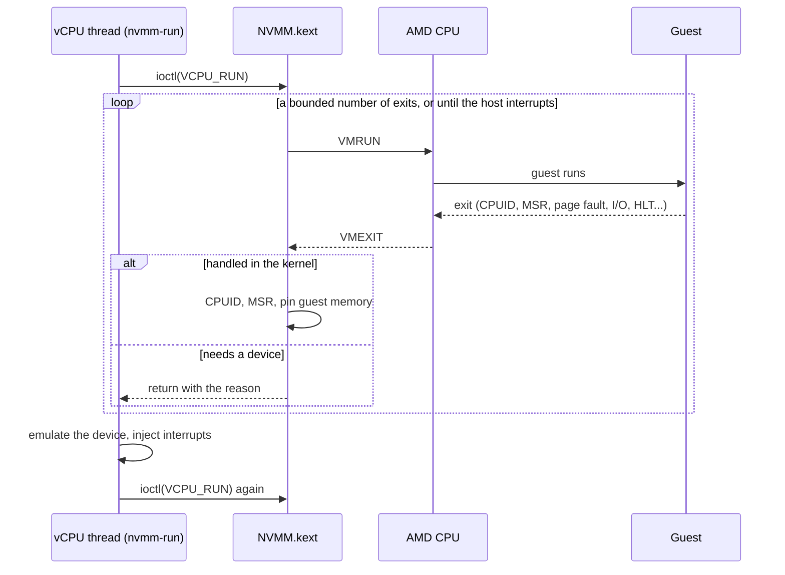
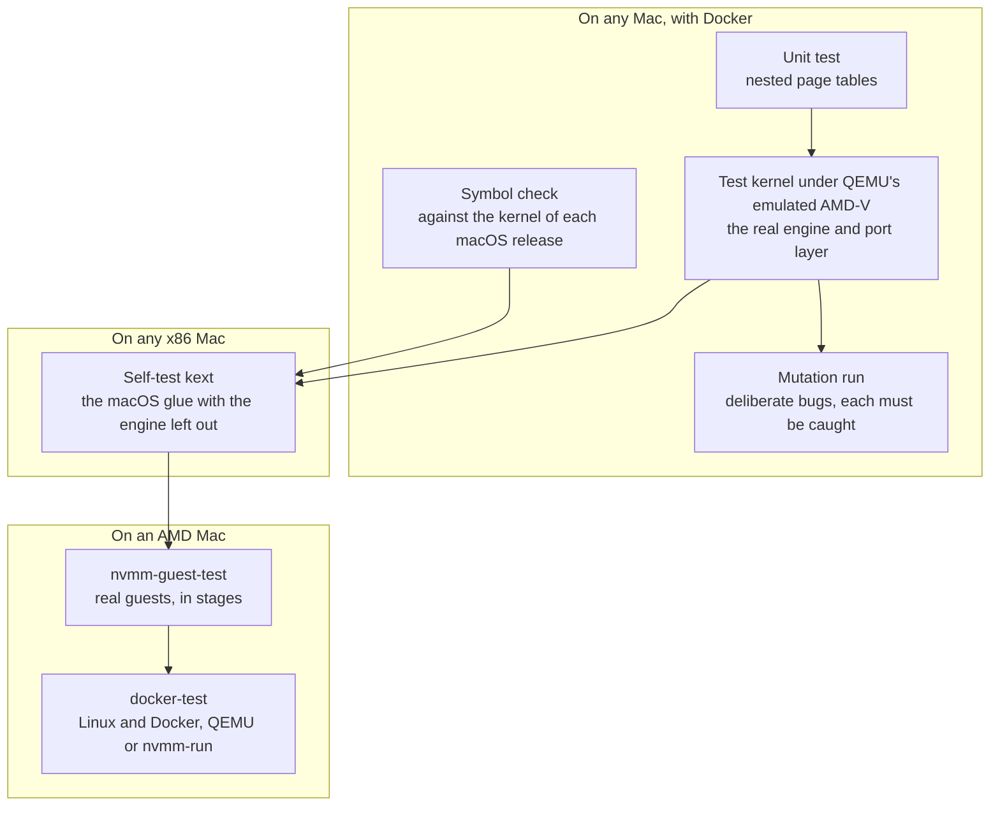

# Graft

**A hypervisor you bring yourself, for x86 hosts that do not have one.**

Running a virtual machine normally depends on the operating system's vendor:
the hypervisor is part of their kernel, and if they do not provide one for
your hardware, nothing you install will change that. Graft is
[NVMM](https://www.dragonflybsd.org/docs/docs/howtos/nvmm/), the hypervisor
of NetBSD and DragonFly BSD, on a thin layer that asks the host for very
little: memory it can pin, a way to share a buffer with a process, a way to
run a function on every CPU, and locks. Port that layer and the rest comes
with it, including a small machine monitor that boots Linux and runs
containers.

| | Today | Not yet |
| --- | --- | --- |
| Processors | AMD, with AMD-V and nested paging | Intel: NVMM has the engine, and it has not been brought through the layer |
| Hosts | macOS, as a kernel extension; and a bare test kernel that is no operating system at all | Any other system |
| Guests | Linux, booted directly | Anything that needs firmware |

It is x86 only, and meant to stay that way: hardware virtualization is a
different mechanism on every processor family, and the engines here are
NVMM's.

The first host is macOS on AMD, because that is a gap with no other fix:
Apple's Hypervisor framework does not work on AMD CPUs, which on an AMD
Hackintosh, or in a macOS guest on an AMD server, rules out Docker Desktop,
OrbStack, Colima and current VirtualBox. With Graft:

```sh
nvmm-docker start
export DOCKER_HOST=unix://$HOME/.nvmm-docker/docker.sock
docker run --rm alpine uname -a
```

> **This is experimental.** It has run on one machine, a Ryzen 7 2700 under
> macOS Catalina, for a short time, and it panicked that machine once on the
> way. A kernel extension that goes wrong takes the whole machine with it.
> Read [Status](#status) before loading it.

## Contents

- [Design](#design)
- [Status](#status)
- [Usage guide](#usage-guide)
- [How it is tested](#how-it-is-tested)
- [How it differs from NVMM on BSD](#how-it-differs-from-nvmm-on-bsd)
- [Known issues](#known-issues)
- [Repository layout](#repository-layout)
- [Resources](#resources)

## Design

NVMM has two halves, as on BSD: a kernel driver that runs guest code on the
processor, and a userland program that provides everything else a machine
needs. They talk through `/dev/nvmm` and the `libnvmm` library.



Two of the five pieces are imported from DragonFly BSD, and three are new:

| Piece | Origin |
| --- | --- |
| AMD-V engine and NVMM core (`src/`) | DragonFly BSD, with small marked changes |
| `libnvmm` (`lib/`) | DragonFly BSD, nearly unchanged |
| Portable OS layer (`port/`) | New. What NVMM needs from an operating system, for a host with no BSD virtual-memory system |
| macOS glue (`darwin/`) | New. The portable layer's few primitives, on IOKit and exported kernel interfaces |
| `nvmm-run`, the VMM (`vmm/`) | New. Boots Linux directly; no firmware, no PCI, no ACPI |

The portable layer is the graft itself. It asks an operating system for very
little: pinned pages whose physical addresses it may know, a way to map a
buffer into a process, a way to run a function on every CPU, and locks.
macOS is one implementation of that list; the test kernel in
`test/baremetal`, which is not an operating system at all, is a second.

### One trip into the guest

A virtual CPU is a thread calling an ioctl in a loop. Most exits are handled
in the kernel and the guest resumes at once; the rest go back to userland,
where the device lives.



### Memory on demand

A guest does not cost its full size from the start. The driver borrows the
memory the VMM already has and pins it a chunk at a time, the first time the
guest touches each chunk.


## Status

Everything here was observed on one machine: a Ryzen 7 2700 running macOS
Catalina.

| Piece | State |
| --- | --- |
| AMD-V engine | Runs real guests on real hardware, and passes its test suite under emulated AMD-V |
| macOS glue | The self-test build passed on macOS Sequoia on an Intel Mac, with the engine left out. The full driver loads and runs on Catalina |
| `libnvmm` | Works; drives both QEMU and `nvmm-run` |
| QEMU with `-accel nvmm` | Boots Alpine Linux and runs Docker, with one vCPU |
| `nvmm-run` | Boots Alpine from a disk image in a few seconds, with one or several vCPUs |
| `nvmm-docker` | `docker` on the Mac runs containers in the VM: output, piped input, pulls, published ports |
| Memory on demand | Tested under emulation. **Compiled but never loaded on a Mac** |
| macOS Sequoia | Symbols check out; the engine has **never run there** |

In short runs, CPU-bound work scales across vCPUs, disk and network speeds
are unremarkable, and an idle VM costs the host little but not nothing. A
few minutes of sustained load on several vCPUs run clean; there are no
results longer than that.

One binary is meant to serve every macOS from the minimum in
`darwin/Info.plist` onwards: the kext imports only exported kernel symbols,
and `tools/check-kpi.sh` confirms each of them against the kernel sources of
any release you name. The release workflow does that for one kernel per
macOS release.

## Usage guide

### Requirements

- An x86-64 Mac or Hackintosh with an **AMD CPU**, SVM enabled in the
  firmware.
- macOS High Sierra or later, with **SIP's kext-signing check off**: the kext
  is unsigned. (`csr-active-config` with its lowest bit set; on a Hackintosh
  that is an OpenCore setting.)
- The Xcode command line tools, to build.
- A machine you can afford to panic.

### Build

```sh
make kext            # build/NVMM.kext
make vmm             # build/nvmm-run
make guest-test      # build/nvmm-guest-test
./tools/check-kpi.sh # every symbol the kext imports is exported (needs gh)
```

### Load the driver

Load it at run time, never from the bootloader, so that a panic costs one
reboot and not a boot loop.

```sh
sudo cp -R build/NVMM.kext /private/var/tmp/
sudo chown -R root:wheel /private/var/tmp/NVMM.kext
sudo kextutil /private/var/tmp/NVMM.kext          # up to Catalina
sudo kmutil load -p /private/var/tmp/NVMM.kext    # Big Sur and later
sudo dmesg | grep nvmm    # nvmm: attached, using backend x86-svm
```

On Big Sur and later the kext also has to be approved in System Settings,
with a restart, once per build. Unload with
`sudo kextunload -b org.nvmm.driver.NVMM`. `/dev/nvmm` is root-only;
`sudo chmod 666 /dev/nvmm` lets your user run VMs until the next load.

### Check it, in stages

`nvmm-guest-test` runs small real guests, in stages of rising risk, and
prints each stage before starting it. Run it over ssh, so the last line
survives a panic.

```sh
sudo build/nvmm-guest-test 1   # open the device. No guest runs
sudo build/nvmm-guest-test 2   # + machines and vCPUs. No guest runs
sudo build/nvmm-guest-test 3   # + the first VMRUN: a guest that halts
sudo build/nvmm-guest-test 4   # + I/O, memory faults, CPUID, FPU, 2M pages
sudo build/nvmm-guest-test     # + long runs, two guests at once
```

### Docker

Build the disk image once. This step uses QEMU, as a build tool only:
nothing at run time needs it.

```sh
./tools/build-qemu.sh       # prints where it put qemu-system-x86_64
ACCEL=nvmm FLAVOR=docker vmm/build-image.exp <qemu-system-x86_64> <alpine-virt.iso> ~/.nvmm-docker
cp <vmlinuz-virt> ~/.nvmm-docker/
```

The ISO is Alpine's "virt" image, and `vmlinuz-virt` is the kernel from the
`netboot` directory of the same Alpine release. They have to match, because
the image takes its kernel modules from the ISO; so does the release named in
`vmm/guest-build.sh`.

Then, with [gvproxy](https://github.com/containers/gvisor-tap-vsock/releases)
and a `docker` client on the PATH (on an old macOS, both may have to be older
releases):

```sh
vmm/nvmm-docker start
export DOCKER_HOST=unix://$HOME/.nvmm-docker/docker.sock
docker run --rm -p 8080:80 nginx:alpine     # then: curl http://127.0.0.1:8080
vmm/nvmm-docker ssh                         # a shell in the VM
vmm/nvmm-docker stop
```

To leave Docker out altogether, build the image without `FLAVOR`, which
gives the default, `containerd`. It then holds containerd and nerdctl and nothing of Docker's: smaller on
disk and lighter in memory, at the price of the Docker API. Nothing that
expects `docker.sock` works with it; containers are run with nerdctl, which
takes docker's command line, inside the VM:

```sh
vmm/nvmm-docker nerdctl run --rm alpine uname -a
vmm/nvmm-docker nerdctl compose up
```

The `docker` image has the Docker daemon and not its client, which stays on
the Mac.

`NVMM_DOCKER_CPUS` and `NVMM_DOCKER_MEM` size the VM; the defaults are at
the top of the script. The Docker socket is readable only by its owner; gvproxy carries
it to the VM over SSH with a key made when the image was built.

### nvmm-run on its own

```sh
build/nvmm-run -k vmlinuz-virt -i initramfs-nvmm -d rootfs.img -c 4 -m 2048 \
    -n /path/to/gvproxy-qemu.sock \
    -a "root=/dev/vda rootfstype=ext4 modules=ext4"
```

The console is the terminal; Ctrl-A then x quits. The guest sees a 16550
serial port, the 8259 interrupt controllers, an 8254 timer, a CMOS clock,
and virtio block and network devices on the memory-mapped transport. With
more than one CPU it also gets a local APIC per CPU and an I/O APIC,
described by an MP table.

### QEMU

`tools/build-qemu.sh` builds QEMU with its `nvmm` accelerator against this
library, with no package manager: it fetches its build tools as Python
wheels and builds glib, pixman and libslirp from source. It picks a current
QEMU where the system's compiler can build one, and an older series where it
cannot. `test/darwin/docker-test.exp` boots
Alpine in it and runs Docker.

## How it is tested

Kernel code that is wrong takes the machine down, so as much as possible is
proven before it touches a real one. The engine runs under an emulated AMD
processor inside an ordinary test, and deliberate bugs are injected to show
the tests can fail.



```sh
make check                  # unit test, emulator suite, kext build
./test/mutation/mutate.py   # slow: one rebuild and run per bug
```

What emulation cannot show, and the first real machine had to: whether a
stale translation survives an unmap (QEMU flushes on every switch), and the
processor's next-instruction-pointer save (QEMU does not emulate it). Both
passed on the Ryzen. What only real macOS could show cost two bugs on the
way: a device node that hung every lookup once its slots ran out, and
"contiguous" memory that was contiguous for a device but not for the CPU.

## How it differs from NVMM on BSD

On BSD, a machine owns an address space whose page tables double as the
guest's, and the kernel's own fault handler fills them. A macOS kernel
extension has no supported way to do that, and earlier hypervisor ports that
reached into private kernel structures stopped working when those changed.
This port uses only exported interfaces, and differs in these ways:

- **Nested page tables are built by hand** (`port/npt.c`), with large pages
  where memory is pinned up front and contiguous.
- **Guest RAM is the process's own memory**, pinned on first touch, rather
  than a kernel object mapped into the process.
- **Host state is saved in a VMCB.** The BSD code restores the task register
  through the host's GDT; here the host's own VMLOAD/VMSAVE state is parked
  in a per-CPU control block, which never touches the GDT.
- **Preemption is held off with a spin lock.** macOS does not export its
  preemption-disable primitive; holding a spin lock has the same effect.
- **The vCPU loop is bounded.** macOS cannot be asked whether the scheduler
  is waiting, so the loop handles a fixed number of exits by itself
  (`NVMM_PORT_EXIT_BUDGET`) and returns to userland on any host interrupt.
- **`/dev/nvmm` is a cloning device**, so that each open gets its own minor
  and machines belong to the open that made them.
- **Allocation can fail.** The imported code assumed some could not; a guest
  too large for the host used to panic it and now gets an error.

`diff -ru upstream/sys/dev/virtual/nvmm src` shows every change to the
imported code. Only the AMD half was imported: there is no Intel support.

## Known issues

- **Barely run.** Nothing here has run for a day, and several vCPUs in one
  machine are the newest and least tested part.
- **One machine, one macOS version.** No Sequoia run of the engine, no
  other AMD CPU.
- **Memory on demand has never been loaded**, and memory pinned that way
  uses small pages. Pinned memory is not given back while the VM runs.
- **vmnet did not work** on the test machine in any mode
  (`vmm/vmnet-probe.c`), so `nvmm-run -n vmnet` is untested and networking
  goes through gvproxy.
- **No file sharing**: `docker run -v /a/mac/path:...` has nothing to mount.
- **Published ports** are forwarded for TCP only.
- **The APICs are reached through the instruction emulator**, which is slow,
  and timers are coarse.
- **Sleep and wake** with a guest running is untested.
- **Hosts that enable AVX-512 lazily per thread** are not handled.
- **`/dev/nvmm` is root-only** by default.

## Repository layout

```text
upstream/   DragonFly BSD's NVMM, pristine, at a pinned commit
src/        the working copy of those sources, with NVMM_PORT hooks
port/       the portable OS layer: guest memory, page tables, locks
darwin/     the macOS kernel extension
lib/        libnvmm
vmm/        nvmm-run, nvmm-docker, and the scripts that build the image
test/       unit, bare-metal, mutation, and on-hardware tests
tools/      check-kpi.sh, build-qemu.sh, bootstrap-deps.sh
```

## Resources

- [NVMM on DragonFly BSD](https://www.dragonflybsd.org/docs/docs/howtos/nvmm/):
  the guide this port's design section follows.
- [DragonFly's NVMM sources](https://github.com/DragonFlyBSD/DragonFlyBSD/tree/master/sys/dev/virtual/nvmm)
  and [libnvmm](https://github.com/DragonFlyBSD/DragonFlyBSD/tree/master/lib/libnvmm),
  which `upstream/` is a copy of.
- [gvisor-tap-vsock](https://github.com/containers/gvisor-tap-vsock): gvproxy.
- [The Linux/x86 boot protocol](https://www.kernel.org/doc/html/latest/arch/x86/boot.html),
  which `nvmm-run` implements the 64-bit entry of.
- AMD64 Architecture Programmer's Manual, volume 2, chapter 15: Secure
  Virtual Machine.

## Licence

Two-clause BSD; see [LICENSE](LICENSE). NVMM is by Maxime Villard and the
DragonFly Project, and the imported files carry their original headers. QEMU
and gvproxy are not part of this repository and are not distributed with it.
