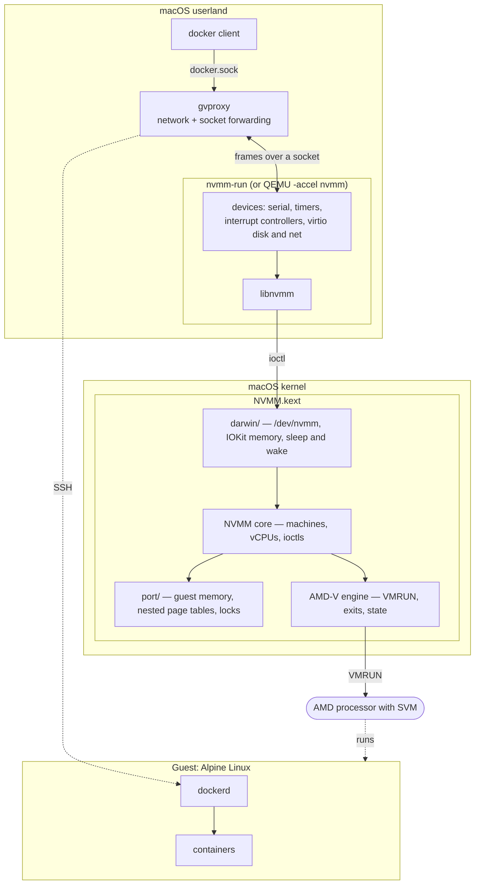
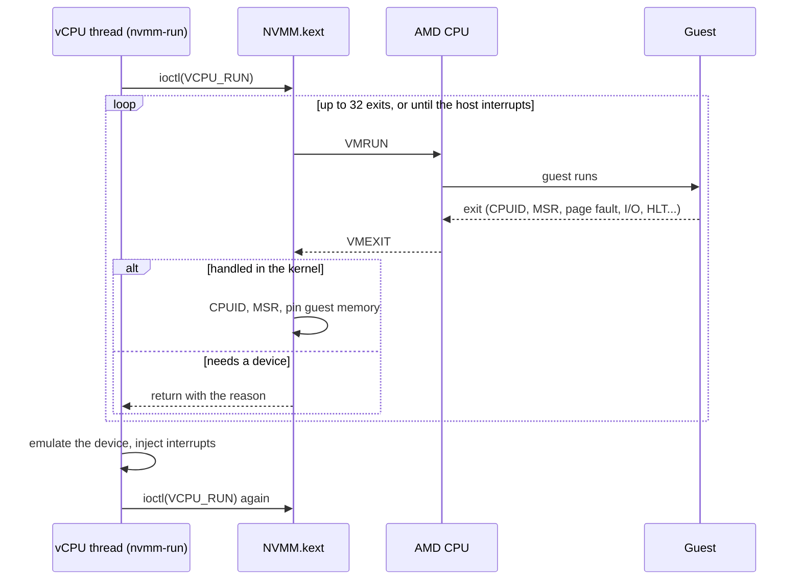
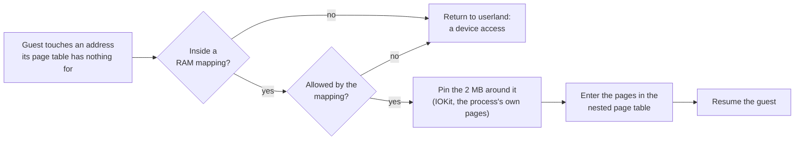
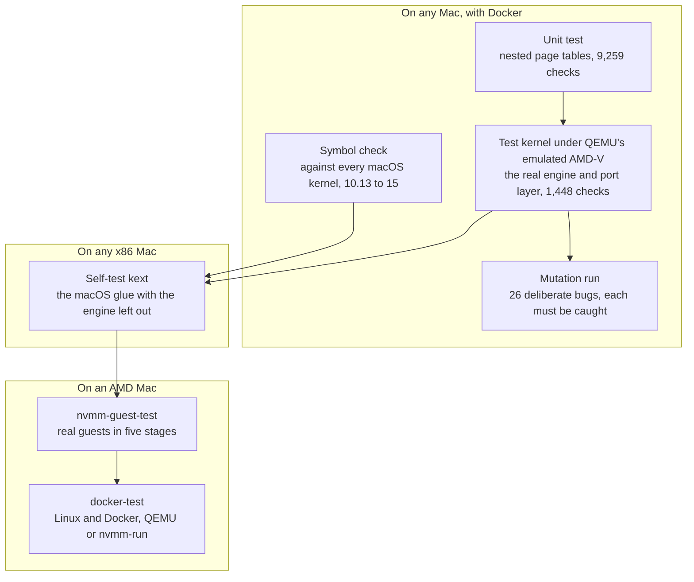

# Graft

**Hardware virtualization for macOS on AMD processors, and Docker on top of
it: the BSD hypervisor NVMM, plus about 6,000 new lines.**

macOS only offers hardware virtualization through Apple's Hypervisor
framework, and that framework does not work on AMD CPUs. On an AMD
Hackintosh, or in a macOS guest on an AMD server, that rules out Docker
Desktop, OrbStack, Colima and current VirtualBox: there is nothing to
install that fixes it.

Graft takes [NVMM](https://www.dragonflybsd.org/docs/docs/howtos/nvmm/), the
hypervisor of NetBSD and DragonFly BSD, and grafts it onto macOS as a kernel
extension. NVMM implements AMD-V itself, so nothing is needed from Apple. On
top of it sit a small virtual machine monitor and a script that turn it into
a Docker host:

```sh
$ nvmm-docker start                 # about six seconds
$ export DOCKER_HOST=unix://$HOME/.nvmm-docker/docker.sock
$ docker run --rm alpine uname -a
Linux 6.18.52-0-virt x86_64
```

> **This is experimental.** It has run on one machine (a Ryzen 7 2700 under
> macOS 10.15.5) for one evening, it panicked that machine once on the way,
> and it has an open bug with several virtual CPUs. A kernel extension that
> goes wrong takes the whole machine with it. Read [Status](#status) before
> loading it.

## Contents

- [Design](#design)
- [Status](#status)
- [Usage guide](#usage-guide)
- [How it is tested](#how-it-is-tested)
- [How it differs from NVMM on BSD](#how-it-differs-from-nvmm-on-bsd)
- [Known issues](#known-issues)
- [Repository layout](#repository-layout)
- [Resources](#resources)

## Design

NVMM has two halves, as on BSD: a kernel driver that runs guest code on the
processor, and a userland program that provides everything else a machine
needs. They talk through `/dev/nvmm` and the `libnvmm` library.



Two of the five pieces are imported from DragonFly BSD, and three are new:

| Layer | Lines | Origin |
| --- | --- | --- |
| AMD-V engine and NVMM core (`src/`) | ~7,000 | DragonFly BSD, with small marked changes |
| `libnvmm` (`lib/`) | ~4,600 | DragonFly BSD, nearly unchanged |
| Portable OS layer (`port/`) | ~1,900 | New. What NVMM needs from an operating system, for a host with no BSD virtual-memory system |
| macOS glue (`darwin/`) | ~1,300 | New. The portable layer's few primitives, on IOKit and exported kernel interfaces |
| `nvmm-run`, the VMM (`vmm/`) | ~2,800 | New. Boots Linux directly; no firmware, no PCI, no ACPI |

The portable layer is the graft itself. It asks an operating system for very
little: pinned pages whose physical addresses it may know, a way to map a
buffer into a process, a way to run a function on every CPU, and locks.
macOS is one implementation of that list; the test kernel in
`test/baremetal`, which is not an operating system at all, is a second.

### One trip into the guest

A virtual CPU is a thread calling an ioctl in a loop. Most exits are handled
in the kernel and the guest resumes at once; the rest go back to userland,
where the device lives.



### Memory on demand

A guest does not cost its full size from the start. The driver borrows the
memory the VMM already has and pins it two megabytes at a time, the first
time the guest touches each piece.



## Status

Everything below was measured on one machine: a Ryzen 7 2700, 16 GB, macOS
10.15.5 (Catalina), on 2026-10-04.

| Piece | State |
| --- | --- |
| AMD-V engine | Runs real guests on real hardware. Under emulated AMD-V its tests pass 1,448 checks |
| macOS glue | Self-test passed on macOS 15.7.9 (Intel, engine left out) and the full driver loads and runs on 10.15.5 |
| `libnvmm` | Works; drives both QEMU and `nvmm-run` |
| QEMU 7.2 with `-accel nvmm` | Boots Alpine Linux and runs Docker, one vCPU |
| `nvmm-run` | Boots Alpine from a disk image in about six seconds; one to eight vCPUs |
| `nvmm-docker` | `docker` on the Mac runs containers in the VM: output, piped input, pulls, published ports |
| Memory on demand | Tested under emulation. **Compiled but never loaded on a Mac** |
| macOS 15 (Sequoia) | Symbols check out; the engine has **never run there** |

Measured with `nvmm-run`:

| | |
| --- | --- |
| `nvmm-docker start` to Docker answering | about 6 s |
| Disk, direct read / direct write / buffered write with sync | about 900 / 550 / 270 MB/s |
| Eight parallel CPU-bound jobs against one | 4.0 s against 2.9 s |
| Idle VM, host CPU | about 1.7% of one core |
| 20-minute load on four vCPUs | 153 rounds, none failed, **one 22-second guest stall** (see below) |

One binary is meant to serve macOS 10.13 through 15: the kext imports only
exported kernel symbols, and `tools/check-kpi.sh` confirms each against the
kernel sources of every release in that range. It has been loaded on
10.15.5 (full driver) and 15.7.9 (self-test build) only.

## Usage guide

### Requirements

- An x86-64 Mac or Hackintosh with an **AMD CPU**, SVM enabled in the
  firmware.
- macOS 10.13 or later, with **SIP's kext-signing check off**: the kext is
  unsigned. (`csr-active-config` with bit 0 set; on a Hackintosh that is an
  OpenCore setting.)
- The Xcode command line tools, to build.
- A machine you can afford to panic.

### Build

```sh
make kext            # build/NVMM.kext
make vmm             # build/nvmm-run
make guest-test      # build/nvmm-guest-test
./tools/check-kpi.sh # every symbol the kext imports is exported
```

### Load the driver

Load it at run time, never from the bootloader, so that a panic costs one
reboot and not a boot loop.

```sh
sudo cp -R build/NVMM.kext /private/var/tmp/
sudo chown -R root:wheel /private/var/tmp/NVMM.kext
sudo kextutil /private/var/tmp/NVMM.kext          # macOS 10.15
sudo kmutil load -p /private/var/tmp/NVMM.kext    # macOS 11 and later
sudo dmesg | grep nvmm    # nvmm: attached, using backend x86-svm
```

On macOS 11 and later the kext also has to be approved in System Settings,
with a restart, once per build. Unload with
`sudo kextunload -b org.nvmm.driver.NVMM`. `/dev/nvmm` is root-only;
`sudo chmod 666 /dev/nvmm` lets your user run VMs until the next load.

### Check it, in stages

`nvmm-guest-test` runs small real guests, in stages of rising risk, and
prints each stage before starting it. Run it over ssh, so the last line
survives a panic.

```sh
sudo build/nvmm-guest-test 1   # open the device. No guest runs
sudo build/nvmm-guest-test 2   # + machines and vCPUs. No guest runs
sudo build/nvmm-guest-test 3   # + the first VMRUN: a guest that halts
sudo build/nvmm-guest-test 4   # + I/O, memory faults, CPUID, FPU, 2M pages
sudo build/nvmm-guest-test     # + long runs, two guests at once
```

### Docker

Build the disk image once. This step uses QEMU, as a build tool only:
nothing at run time needs it.

```sh
./tools/build-qemu.sh
ACCEL=nvmm vmm/build-image.exp <qemu-system-x86_64> <alpine-virt.iso> ~/.nvmm-docker
cp <the ISO's boot/vmlinuz-virt> ~/.nvmm-docker/
```

Then, with [gvproxy](https://github.com/containers/gvisor-tap-vsock/releases)
and a `docker` client on the PATH:

```sh
vmm/nvmm-docker start
export DOCKER_HOST=unix://$HOME/.nvmm-docker/docker.sock
docker run --rm -p 8080:80 nginx:alpine     # then: curl http://127.0.0.1:8080
vmm/nvmm-docker ssh                         # a shell in the VM
vmm/nvmm-docker stop
```

`NVMM_DOCKER_CPUS` and `NVMM_DOCKER_MEM` size the VM (default: one CPU,
2048 MB). The Docker socket is readable only by its owner; gvproxy carries
it to the VM over SSH with a key made when the image was built.

### nvmm-run on its own

```sh
build/nvmm-run -k vmlinuz-virt -i initramfs-nvmm -d rootfs.img -c 4 -m 2048 \
    -n /path/to/gvproxy-qemu.sock \
    -a "root=/dev/vda rootfstype=ext4 modules=ext4"
```

The console is the terminal; Ctrl-A then x quits. The guest sees a 16550
serial port, the 8259 interrupt controllers, an 8254 timer, a CMOS clock,
and virtio block and network devices on the memory-mapped transport. With
more than one CPU it also gets a local APIC per CPU and an I/O APIC,
described by an MP table.

### QEMU

`tools/build-qemu.sh` builds QEMU with its `nvmm` accelerator against this
library, with no package manager: it fetches its build tools as Python
wheels and builds glib, pixman and libslirp from source. It picks QEMU 11 on
macOS 12 and later and 7.2 before that. `test/darwin/docker-test.exp` boots
Alpine in it and runs Docker.

## How it is tested

Kernel code that is wrong takes the machine down, so as much as possible is
proven before it touches a real one. The engine runs under an emulated AMD
processor inside an ordinary test, and deliberate bugs are injected to show
the tests can fail.



```sh
make check                  # unit test, emulator suite, kext build
./test/mutation/mutate.py   # slow: one rebuild and run per bug
```

What emulation cannot show, and the first real machine had to: whether a
stale translation survives an unmap (QEMU flushes on every switch), and the
processor's next-instruction-pointer save (QEMU does not emulate it). Both
passed on the Ryzen. What only real macOS could show cost two bugs on the
way: a device node that hung every lookup after sixteen, and "contiguous"
memory that was contiguous for a device but not for the CPU.

## How it differs from NVMM on BSD

On BSD, a machine owns an address space whose page tables double as the
guest's, and the kernel's own fault handler fills them. A macOS kernel
extension has no supported way to do that, and earlier hypervisor ports that
reached into private kernel structures stopped working when those changed.
This port uses only exported interfaces, and differs in these ways:

- **Nested page tables are built by hand** (`port/npt.c`), with 2 MB pages
  where memory is pinned up front and contiguous.
- **Guest RAM is the process's own memory**, pinned on first touch, rather
  than a kernel object mapped into the process.
- **Host state is saved in a VMCB.** The BSD code restores the task register
  through the host's GDT; here the host's own VMLOAD/VMSAVE state is parked
  in a per-CPU control block, which never touches the GDT.
- **Preemption is held off with a spin lock.** macOS does not export its
  preemption-disable primitive; holding a spin lock has the same effect.
- **The vCPU loop is bounded.** macOS cannot be asked whether the scheduler
  is waiting, so the loop handles at most 32 exits by itself and returns to
  userland on any host interrupt.
- **`/dev/nvmm` is a cloning device**, so that each open gets its own minor
  and machines belong to the open that made them.
- **Allocation can fail.** The imported code assumed some could not; a guest
  too large for the host used to panic it and now gets an error.

`diff -ru upstream/sys/dev/virtual/nvmm src` shows every change to the
imported code. Only the AMD half was imported: there is no Intel support.

## Known issues

- **A 22-second guest stall with four vCPUs.** During a 20-minute load test
  the guest's watchdog reported two CPUs stuck at the same moment, once. The
  workload recovered. The cause is not known yet; it may be in `nvmm-run`
  or in the driver.
- **Hours old.** Nothing here has run for a day, and several vCPUs in one
  machine are the newest and least tested part.
- **One machine, one macOS version.** No Sequoia run of the engine, no
  other AMD CPU.
- **Memory on demand has never been loaded**, and memory pinned that way
  uses 4 KB pages. Pinned memory is not given back while the VM runs.
- **vmnet did not work** on the test machine in any mode
  (`vmm/vmnet-probe.c`), so `nvmm-run -n vmnet` is untested and networking
  goes through gvproxy.
- **No file sharing**: `docker run -v /a/mac/path:...` has nothing to mount.
- **Published ports** are forwarded for TCP only.
- **The APICs are reached through the instruction emulator**, which is slow,
  and timers are served at about one-millisecond resolution.
- **Sleep and wake** with a guest running is untested.
- **Hosts that enable AVX-512 lazily per thread** are not handled.
- **`/dev/nvmm` is root-only** by default.

## Repository layout

```text
upstream/   DragonFly BSD's NVMM, pristine, at a pinned commit
src/        the working copy of those sources, with NVMM_PORT hooks
port/       the portable OS layer: guest memory, page tables, locks
darwin/     the macOS kernel extension
lib/        libnvmm
vmm/        nvmm-run, nvmm-docker, and the scripts that build the image
test/       unit, bare-metal, mutation, and on-hardware tests
tools/      check-kpi.sh, build-qemu.sh, bootstrap-deps.sh
```

[VISION.md](VISION.md) is about where this could go beyond one machine.

## Resources

- [NVMM on DragonFly BSD](https://www.dragonflybsd.org/docs/docs/howtos/nvmm/):
  the guide this port's design section follows.
- [DragonFly's NVMM sources](https://github.com/DragonFlyBSD/DragonFlyBSD/tree/master/sys/dev/virtual/nvmm)
  and [libnvmm](https://github.com/DragonFlyBSD/DragonFlyBSD/tree/master/lib/libnvmm),
  which `upstream/` is a copy of.
- [gvisor-tap-vsock](https://github.com/containers/gvisor-tap-vsock): gvproxy.
- [The Linux/x86 boot protocol](https://www.kernel.org/doc/html/latest/arch/x86/boot.html),
  which `nvmm-run` implements the 64-bit entry of.
- AMD64 Architecture Programmer's Manual, volume 2, chapter 15: Secure
  Virtual Machine.

## Licence

Two-clause BSD; see [LICENSE](LICENSE). NVMM is by Maxime Villard and the
DragonFly Project, and the imported files carry their original headers. QEMU
and gvproxy are not part of this repository and are not distributed with it.
