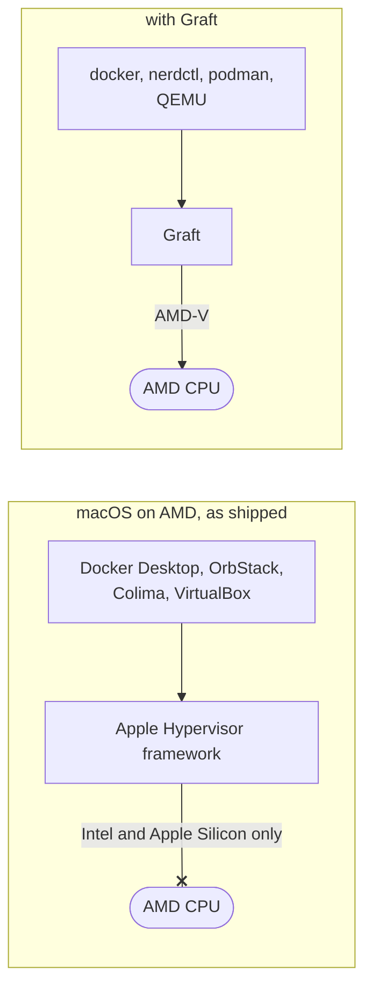
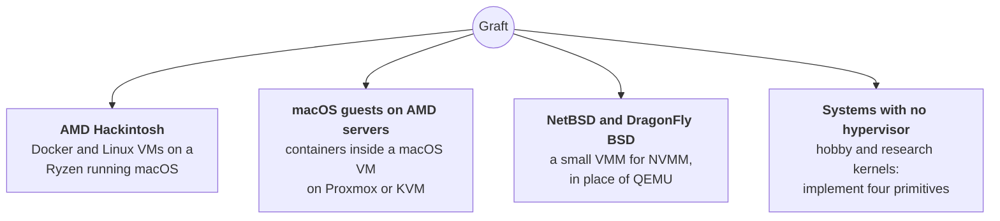
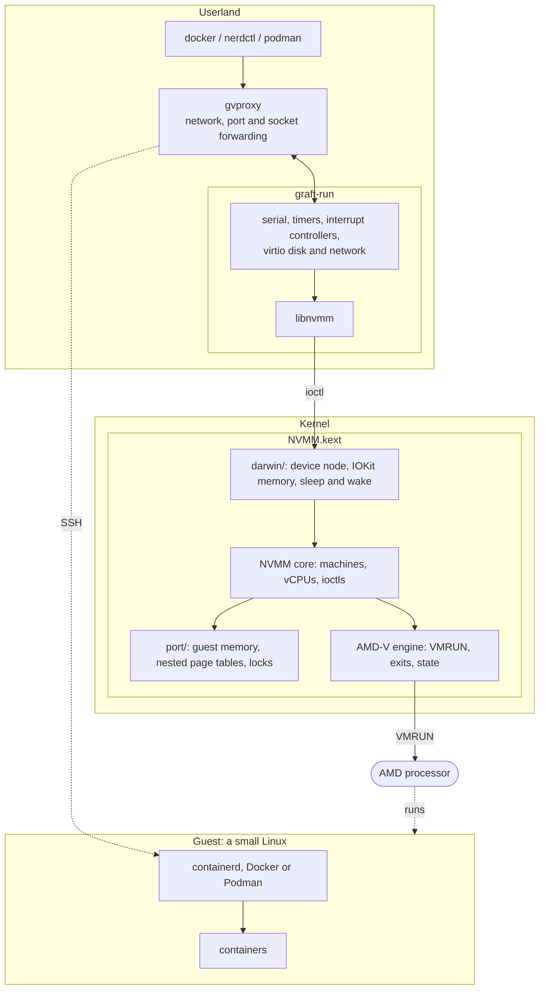
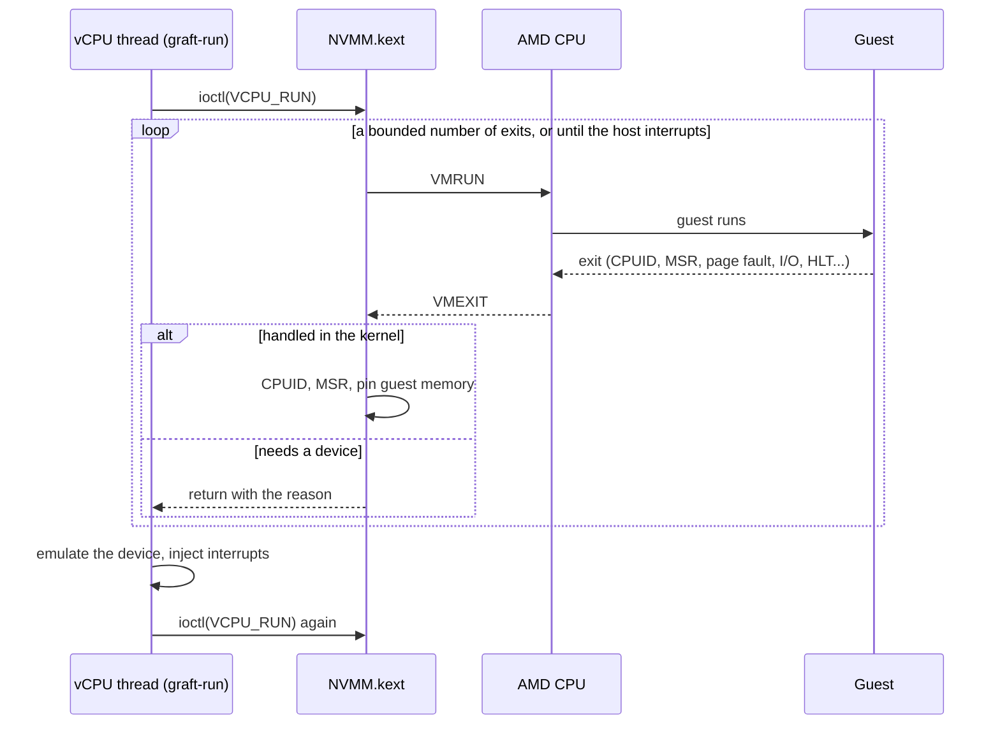
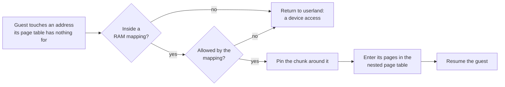
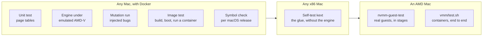

# Graft

**A hypervisor you bring yourself, for x86 hosts that do not have one.**

Graft runs virtual machines and containers on systems whose vendor provides
no hypervisor for the hardware. Its first target is macOS on AMD processors,
where it makes Docker work.

```sh
graft start
graft nerdctl run --rm alpine uname -a
```

## The problem

A virtual machine needs the processor's virtualization extensions, and only
kernel code can use them. Normally that code is the operating system's own
hypervisor. When the vendor does not provide one for your hardware, nothing
you install on top can make up for it.



Graft is [NVMM](https://www.dragonflybsd.org/docs/docs/howtos/nvmm/), the
hypervisor of NetBSD and DragonFly BSD, on a thin layer that asks its host
for very little: memory it can pin, a way to share a buffer with a process,
a way to run a function on every CPU, and locks. Port that layer to a system
and the hypervisor comes with it.

## Use cases



| Scenario | What Graft gives |
| --- | --- |
| macOS on an AMD CPU | Hardware-accelerated VMs and a container host, where Apple's framework gives nothing |
| A macOS VM on an AMD server | The same, inside the guest, when the host passes AMD-V through |
| A BSD that already has NVMM | `graft-run`: a machine monitor that boots Linux directly, far smaller than QEMU |
| An x86 kernel with no hypervisor | A port of four primitives instead of a hypervisor written from scratch |

## What is in it



| Piece | Origin | Role |
| --- | --- | --- |
| AMD-V engine and NVMM core (`src/`) | DragonFly BSD | Runs guest code on the processor |
| `libnvmm` (`lib/`) | DragonFly BSD | The API emulators are written against |
| Portable layer (`port/`) | New | Everything NVMM needs from a host, on four primitives |
| macOS glue (`darwin/`) | New | Those primitives on IOKit and exported kernel interfaces |
| `graft-run` (`vmm/`) | New | Boots Linux directly: no firmware, no PCI, no ACPI |

QEMU works too: it has an `nvmm` accelerator, and `tools/build-qemu.sh`
builds it against this library.

## Quick start

**Requirements:** an x86-64 Mac or Hackintosh with an AMD CPU and SVM enabled
in the firmware; macOS High Sierra or later with SIP's kext-signing check off
(the kext is unsigned); the Xcode command line tools.

> A kernel extension that goes wrong takes the machine down with it. This is
> experimental software: load it at run time, never from the bootloader.

### 1. Build and load the driver

```sh
make kext vmm
sudo cp -R build/NVMM.kext /private/var/tmp/
sudo chown -R root:wheel /private/var/tmp/NVMM.kext
sudo kextutil /private/var/tmp/NVMM.kext          # up to Catalina
sudo kmutil load -p /private/var/tmp/NVMM.kext    # Big Sur and later
sudo chmod 666 /dev/nvmm                          # let your user run VMs
```

`sudo build/nvmm-guest-test` checks the driver with small real guests, in
stages of rising risk.

### 2. Build the VM image, once

```sh
./tools/build-qemu.sh       # QEMU is used to build the image, not to run it
ACCEL=nvmm vmm/build-image.exp <qemu-system-x86_64> <alpine-virt.iso> ~/.graft
cp <vmlinuz-virt> ~/.graft/
```

The ISO is Alpine's "virt" image and `vmlinuz-virt` the kernel from the
`netboot` directory of the same Alpine release.

### 3. Run containers

With [gvproxy](https://github.com/containers/gvisor-tap-vsock/releases) on
the PATH:

```sh
vmm/graft start
vmm/graft nerdctl run --rm -p 8080:80 nginx:alpine   # then: curl 127.0.0.1:8080
vmm/graft ssh                                        # a shell in the VM
vmm/graft stop
```

`GRAFT_CPUS` and `GRAFT_MEM` size the VM.

## Container runtimes

What the VM runs containers with is chosen when the image is built, with
`FLAVOR=`. Each is one small file in `vmm/flavors/`; adding a runtime is
adding a file.

| Flavor | In the VM | Used from the Mac as | Docker API |
| --- | --- | --- | --- |
| `containerd` (default) | containerd, nerdctl, crun | `graft nerdctl …` | no |
| `docker` | the Docker daemon | a `docker` client, through a socket | yes |
| `podman` | Podman and its API service | a `docker` or `podman` client, or `graft podman …` | yes |

`containerd` is the smallest and lightest. Choose `docker` or `podman` when
something needs `docker.sock`: Compose, dev containers, test frameworks.

```sh
FLAVOR=docker ACCEL=nvmm vmm/build-image.exp <qemu> <iso> ~/.graft
vmm/graft start
export DOCKER_HOST=unix://$HOME/.graft/docker.sock
docker run --rm alpine uname -a
```

Ports that containers publish appear on the Mac's loopback address. The
socket is readable only by its owner and reaches the VM over SSH.

## How it works

### One trip into the guest

A virtual CPU is a thread calling an ioctl in a loop. Most exits are handled
in the kernel and the guest resumes at once; the rest return to userland,
where the devices live.



### Memory on demand

A guest costs what it uses, not what it was given. The driver borrows the
memory the VMM already has and pins it a chunk at a time, on first touch.



### The machine graft-run provides

A 16550 serial port, the 8259 interrupt controllers, an 8254 timer, a CMOS
clock, and virtio block and network devices on the memory-mapped transport.
With more than one CPU, each gets a local APIC and its own thread, and the
machine an I/O APIC, described by an MP table.

```sh
build/graft-run -k vmlinuz-virt -i initramfs-graft -d rootfs.img -c 4 -m 2048 \
    -n /path/to/gvproxy.sock -a "root=/dev/vda rootfstype=ext4 modules=ext4"
```

## How it is tested

Kernel code that is wrong takes the machine down, so as much as possible is
proven before it touches a real one. The engine runs under an emulated AMD
processor inside an ordinary test, and deliberate bugs are injected to show
that the tests can fail.



```sh
make check                  # unit test, emulator suite, kext build
./test/mutation/mutate.py   # one rebuild and run per injected bug
./test/image/run.sh         # build and boot an image of each flavor
./tools/check-kpi.sh        # every symbol the kext imports is exported
vmm/test.sh                 # on the AMD Mac: the VM, end to end
```

The kext imports only symbols macOS exports to kernel extensions, and the
symbol check confirms each against the kernel sources of any release you
name. That is what lets one binary serve many macOS versions.

## How it differs from NVMM on BSD

On BSD, a machine owns an address space whose page tables double as the
guest's, and the kernel's own fault handler fills them. A macOS kernel
extension has no supported way to do that, so this port uses only exported
interfaces:

- **Nested page tables are built by hand** (`port/npt.c`).
- **Guest RAM is the process's own memory**, pinned on first touch.
- **Host state is saved in a VMCB** instead of being restored through the
  host's GDT.
- **Preemption is held off with a spin lock**: macOS does not export its
  preemption-disable primitive.
- **The vCPU loop is bounded** (`NVMM_PORT_EXIT_BUDGET`) and returns to
  userland on any host interrupt, because the scheduler cannot be asked
  whether it is waiting.
- **`/dev/nvmm` is a cloning device**, so machines belong to the open that
  made them.

`diff -ru upstream/sys/dev/virtual/nvmm src` shows every change to the
imported code.

## Limitations

- AMD only. NVMM has an Intel engine; it has not been brought through the
  layer.
- Linux guests only, booted directly.
- No file sharing yet: `-v /a/mac/path:...` has nothing to mount.
- Published ports are forwarded for TCP only.
- macOS's vmnet is supported by `graft-run -n vmnet` but networking normally
  goes through gvproxy, which needs no privileges.
- `/dev/nvmm` is root-only until its mode is changed.

## Repository layout

```text
upstream/   DragonFly BSD's NVMM, pristine, at a pinned commit
src/        the working copy of those sources, with NVMM_PORT hooks
port/       the portable layer: guest memory, page tables, locks
darwin/     the macOS kernel extension
lib/        libnvmm
vmm/        graft-run, graft, runtime flavors, image build
test/       unit, bare-metal, mutation, image and on-hardware tests
tools/      check-kpi.sh, build-qemu.sh, bootstrap-deps.sh
```

## Resources

- [NVMM on DragonFly BSD](https://www.dragonflybsd.org/docs/docs/howtos/nvmm/)
- [DragonFly's NVMM sources](https://github.com/DragonFlyBSD/DragonFlyBSD/tree/master/sys/dev/virtual/nvmm)
  and [libnvmm](https://github.com/DragonFlyBSD/DragonFlyBSD/tree/master/lib/libnvmm)
- [gvisor-tap-vsock](https://github.com/containers/gvisor-tap-vsock) (gvproxy)
- [The Linux/x86 boot protocol](https://www.kernel.org/doc/html/latest/arch/x86/boot.html)
- AMD64 Architecture Programmer's Manual, volume 2, chapter 15

## Licence

Two-clause BSD; see [LICENSE](LICENSE). NVMM is by Maxime Villard and the
DragonFly Project, and the imported files carry their original headers. QEMU
and gvproxy are not part of this repository and are not distributed with it.
